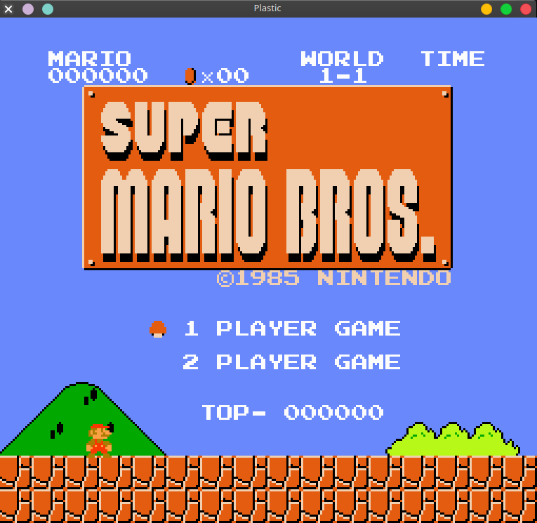

# plastic

[](https://actions-badge.atrox.dev/Amjad50/plastic/goto)
[](https://codecov.io/gh/Amjad50/plastic)
[](./LICENSE)

**plastic** is a [NES][NES-wiki] emulator built from scratch using [Rust][Rust].

This is a personal project for fun and to experience emulating hardware and connecting them together.

### Components
- [x] 6502 CPU, all official and unofficial instructions with accurate timing (without BCD mode).
- [x] Picture Processing Unit, almost accurate with some small timing issues that would not effect most games.
- [x] Cartridge and INES file handling (still missing INES2.0)
- [x] Mappers:
  - [x] Mapper 0
  - [x] Mapper 1
  - [x] Mapper 2
  - [x] Mapper 3
  - [x] Mapper 4
  - [ ] Mapper 5 (Milestone)
  - [ ] Mapper 6
  - [x] Mapper 7
  - [ ] Mapper 8
  - [x] Mapper 9
- [ ] Audio Processing Unit:
  - [x] 2 Pulse wave(square)
  - [x] Triangle
  - [ ] Noise
  - [ ] DMC
  - [x] IRQ support
- [x] Controller:
  controllable using the keyboard and controller (tested with PS4 controller)

### Interfaces
One advantage of this emulator is the great abstraction, for example, adding UI
handlers for the emulator is very easy and straight forward. All you have to do
is to write a [`UiProvider`](./nes_ui_base/src/lib.rs), and simply
use it with [`NES`](./nes_ui_base/src/nes.rs) like so:
```rust
use nes_ui_base::nes::NES;

// Provider implement trait `UiProvider`
let mut nes = NES::new("path/to/rom.nes", Provider {})?;

nes.run();
```

Using this design, I have implemented some providers which have
different purposes:

#### SFML


[SFML][SFML] is a game development UI library, it has a good and
easy to use API and is the most performing UI in the list.

#### Advantages
1. Designed for Canvas and raw drawing, which makes it faster.
2. Has support for gamepad (only tested with PS4).

#### GTK


[GTK][GTK] is a casual GUI library that is used to make all kinds
of applications and not designed for games.

The reason I chose to go with it is for future plans to add a
debugger, which would be a lot easier to add in this UI compared
to [SFML](#sfml).

From the screenshot, it looks exactly like SFML, and that's because
I haven't added anything specific to GTK yet. But it has almost the
same performance as SFML, so hopefully there will not be much
different in performance even after adding the debugger.

#### Advantages
1. Ability to add buttons and menus which enable easier integration
   for debuggers and anything similar.
#### Disadvantages
1. Does not offer gamepad support, but it can be added through
   other external libraries.

#### TUI
[](https://www.youtube.com/watch?v=cMO89-Xljr8)

This is just for fun, but it is actually working way better than
I expected. Check the demo.

I used [gilrs][gilrs] for gamepad support and its working very
nicely, keyboard on the other hand is not very responsive, so it
is advised to use gamepad. Also since this uses one character for
each pixel, it is advised to use the smallest font size your
terminal emulator supports. Have fun.

### Controls
In all the UI providers I followed the same controlling scheme:

#### Keyboard
| keyboard | nes controller |
| -------- | -------------- |
| J | B |
| K | A |
| U | Select |
| I | Start |
| W | Up |
| S | Down |
| A | Left |
| D | Right |

#### Gamepad
| gamepad (PS4) | nes controller |
| -------- | -------------- |
| X | B |
| O | A |
| Select | Select |
| Start | Start |
| Button Up | Up |
| Button Down | Down |
| Button Left | Left |
| Button Right | Right |

For now its static, and there is no way to change it except for
doing it in the code, TODO later.

### References
Most of the documentation for NES components can be found in the [NES dev wiki](http://wiki.nesdev.com/w/index.php/Nesdev_Wiki)

For the CPU(6502), [this](https://www.masswerk.at/6502/6502_instruction_set.html) has the instruction set, and I used
[Klaus2m5's tests](https://github.com/Klaus2m5/6502_65C02_functional_tests) for testing the CPU alone without the other NES components.


[NES-wiki]: https://en.wikipedia.org/wiki/Nintendo_Entertainment_System
[Rust]: https://www.rust-lang.org/
[SFML]: https://www.sfml-dev.org/
[GTK]: https://www.gtk.org/
[gilrs]: https://gitlab.com/gilrs-project/gilrs
